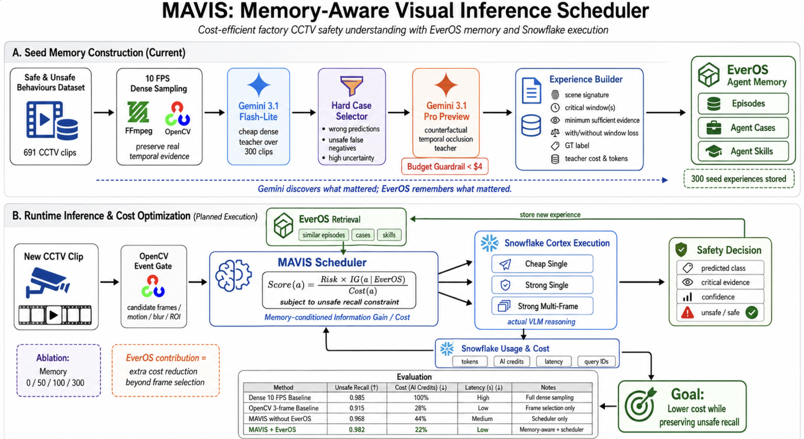

# MAVIS — Memory-Aware Visual Inference Scheduler

> Not every frame deserves intelligence.
> Remember what was useful. Reason only when it is worth the cost.

## Overall architecture



The diagram separates seed-memory construction from planned runtime execution. Its quantitative annotations have not been verified by a live Snowflake benchmark; see [Status](#status).

Running a strong VLM on every CCTV frame understands far more than rule-based CV
— a worker drifting into a forklift's path, a load that is becoming unstable, a
near-miss that only exists across time. It also costs more than anyone wants to
pay. MAVIS keeps the understanding and drops most of the bill by deciding, frame
by frame, whether the next expensive look is worth buying.

```
minimise  E[ Cortex inference cost ]   subject to   hazard recall ≥ τ
```

Three parts, each doing one thing:

| | |
|---|---|
| **Snowflake** | actually looks at the frame, and reports what that cost |
| **EverOS** | remembers which past observations paid for themselves |
| **MAVIS** | decides whether the next one is worth paying for |

Remove Snowflake and there is no visual reasoning and no real cost to reduce.
Remove EverOS and MAVIS loses its only answer to *"in a situation like this, what
was actually worth looking at?"* — it is the scheduling prior, not decoration.

## The decision

For each candidate action:

```
Score(a) = −C(a) + ε_risk · E[ ΔH(a) | M_t ]
```

`C(a)` is what that action has actually cost in comparable situations. `ΔH` is
information gain in bits, `H(b_before) − H(b_after)` — always measured after the
fact, never assumed. `ε_risk` is how many units of cost one bit is worth right
now, which rises with the risk on screen.

Two properties matter more than the formula:

**Cold start degrades, it does not lie.** Memory returns a support weight with
every estimate. Zero support means the scheduler falls back entirely to a static
prior; memory takes over gradually as support accumulates. An empty store yields
a sane fixed policy, not a confident one built from a single episode.

**Recall has a floor that scoring cannot breach.** Pure argmax will happily trade
recall for credits, and "82% cheaper" against collapsed recall is worthless.
Strong calls are forced when the scene sits in the ambiguous risk band, when too
long has passed since the last strong look, and on each clip's first gated frame.
The benchmark reports how many strong calls the policy *chose* versus how many
the floor *demanded* — if the floor is doing all the work, that is visible.

## Pipeline

```
CCTV clip
    │
    ├─ OpenCV cheap gate ─────── duplicate / no-motion frames dropped, free
    │
    ├─ MAVIS stage 1 ─────────── worth even a cheap look?  SKIP costs nothing
    │
    ├─ Snowflake AI_CLASSIFY ─── cheap scene understanding
    │
    ├─ EverOS search ─────────── similar episodes, cases, skills, relevance
    │
    ├─ MAVIS stage 2 ─────────── SKIP / CHEAP_VLM / STRONG_VLM / MULTIFRAME
    │
    ├─ Snowflake AI_COMPLETE ─── contextual VLM reasoning  (show_details ⇒ tokens)
    │
    ├─ hazard belief update ──── measured ΔH
    │
    └─ EverOS write ──────────── (scene, action, ΔH, real cost, outcome)
```

Splitting the decision in two is where the saving comes from. Classifying every
gated frame would put a hard floor under the cost; stage 1 removes frames before
anything is spent at all.

## Dataset

Mendeley [*Video Dataset for Safe and Unsafe Behaviours*](https://data.mendeley.com/datasets/xjmtb22pff/1)
(`xjmtb22pff`), 691 clips. Four unsafe classes, each paired with a visually
similar safe one:

| hazard | safe counterpart |
|---|---|
| `0_safe_walkway_violation` | `4_safe_walkway` |
| `1_unauthorized_intervention` | `5_authorized_intervention` |
| `2_opened_panel_cover` | `6_closed_panel_cover` |
| `3_carrying_overload_with_forklift` | `7_safe_carrying` |

The pairing is why this dataset suits the problem. A cheap classifier sees
"worker near forklift" in both members of a pair; only the strong tier separates
them. That gap is exactly the region where an expensive call earns its cost, and
everywhere else is where MAVIS should be saving.

Clip-level class labels are the hazard ground truth, so no manual labelling is
needed. `train/` warms memory, `test/` is held out for measurement.

### Getting the clips

The archive is 9.3 GB and the origin throttles to ~50 KB/s in aggregate —
downloading it whole takes over two days. It does honour HTTP Range, and a ZIP's
central directory sits at the tail, so individual members can be pulled without
the rest:

```bash
python3 scripts/fetch_clips.py --index          # cache the file index
python3 scripts/fetch_clips.py --list           # per-class counts and sizes
python3 scripts/fetch_clips.py --per-class 3    # fetch the 3 smallest per class
```

## Usage

```bash
uv venv && uv pip install -e ".[dev]"

mavis data                      # what is on disk
mavis demo <clip> --out out.mp4 # one clip, decision overlay
mavis bench                     # baseline vs MAVIS
mavis smoke                     # verify live Snowflake image inference
```

Everything defaults to `--cortex mock`, which fabricates answers and token counts
so the pipeline runs on a bare checkout. **Nothing a mock run prints is
evidence** — `bench` stamps a banner on it saying so. Real numbers need
`--cortex snowflake`.

## Measuring it honestly

**Recall is per clip, not per frame.** MAVIS exists to not look at every frame,
so frame-level recall would penalise it for working as designed and any headline
computed that way would be meaningless. A clip counts as detected if belief
crosses the threshold at any point; the cost of skipping shows up separately as
detection latency.

**False positives are reported alongside.** Any scheduler can hold recall at 100%
by calling everything dangerous, so cost reduction is only meaningful next to the
false-positive rate on the paired safe classes.

**Costs come from Snowflake, not from us.** `show_details => TRUE` gives token
counts live, which is what the scheduler charges against.
`CORTEX_AI_FUNCTIONS_USAGE_HISTORY` is the billing record but lags by hours, so
the benchmark runs on tokens now and `mavis.usage.reconcile` stamps real credits
onto the saved result afterwards. A submitted number should come from that second
pass.

**The baseline gets a fair shot.** Same clips, same order, same Cortex client,
same prompt, same belief model — the only difference is *when* an expensive call
happens. `--baseline-gated` additionally hands the baseline the same free OpenCV
filter, which is the harder comparison; both are reported.

## Layout

```
mavis/
  gate.py        OpenCV duplicate / no-motion filter
  belief.py      log-odds hazard belief, entropy, measured ΔH
  scheduler.py   the decision engine and the recall floor
  cortex/        base.py (protocol) · snowflake.py (real) · mock.py (dev only)
  memory/        base.py (protocol) · everos.py (real) · local.py (JSONL fallback)
  runner.py      policy execution, shared by baseline and MAVIS
  metrics.py     clip-level recall, latency, cost accounting
  benchmark.py   warm-up → baseline → MAVIS
  usage.py       reconcile against Snowflake's billing record
```

## Status

Built and unit-tested against the mock client. The Snowflake adapter is written
against the documented SQL surface but **has not been run against a live
account** — `mavis smoke` is the gate for that. EverOS field names are read
defensively, so a schema mismatch shows up as "memory is not helping" rather than
a crash.
